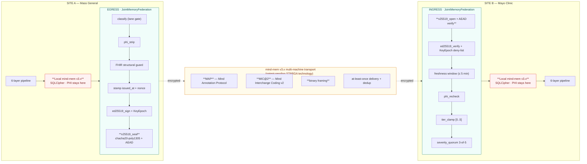
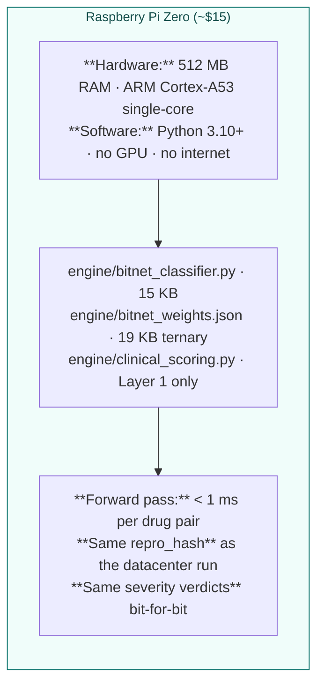

# ClinicalMem — Deployment Architecture

> *"Every layer is independently auditable. The whole stack is reproducible
>  bit-for-bit on a Raspberry Pi or an enterprise GPU cluster."*

This document is the canonical deployment-architecture reference for
ClinicalMem. It complements the per-component docs (`docs/bitnet_training.md`,
`docs/federated_memory.md`, `docs/clinical_validation.md`,
`docs/fda_q_sub_draft.md`) by showing how the pieces fit together at runtime
and across sites.

## Single-site deployment (one hospital)

```mermaid
flowchart TB
    EHR["**EHR / SMART-on-FHIR**<br/>Epic · Cerner · MEDITECH"]
    AGENT(["Healthcare AI Agent"])

    EHR -->|"FHIR R4 Bundle<br/>(Patient + Conditions + MedicationStatement<br/>+ Practitioners with NPI + AllergyIntolerance)"| FHIR

    subgraph INGEST["engine.fhir_adapter.ingest_bundle()"]
      FHIR["FHIR R4 validation<br/>· PHI Safe Harbor scrub (18 ids)<br/>· NPI Luhn validate<br/>· canonical SHA-256 anchor"]
    end

    FHIR -->|"ClinicalIngestResult<br/>(meds, conditions, allergies,<br/>observations, practitioner_npis)"| L1

    subgraph PIPELINE["6-LAYER SAFETY PIPELINE"]
      direction TB
      L1["L1 · Deterministic table<br/>&lt; 1 ms · OFFLINE"]
      L2["L2 · OpenEvidence API<br/>~2 s · ONLINE"]
      L3["L3 · NIH RxNorm DDI<br/>~1 s · ONLINE"]
      L4["L4 · 5-LLM consensus<br/>~3 s · ONLINE"]
      L45["**L4.5 · BitNet b1.58 (Q16.16)**<br/>&lt; 1 ms · OFFLINE<br/>FDA SaMD reproducibility primitive<br/>**100% recall contraindicated (NTI)**"]
      L5["L5 · LLM synthesis (cited)<br/>~3 s · ONLINE"]
      L6["L6 · Abstention gate<br/>0 ms · OFFLINE"]
      L1 --> L2 --> L3 --> L4 --> L45 --> L5 --> L6
    end

    L6 -->|"list[DrugInteraction] +<br/>bitnet_severity + repro_hash + weights_id"| MEM

    subgraph MEM["mind-mem v3.x (local store)"]
      MEM_INNER["SQLCipher at-rest (HIPAA)<br/>· BM25 + vector + RRF retrieval<br/>· TAG_v1 NUL-separated audit chain (Q16.16)<br/>· Local Qwen-3.5-4B memory extract<br/>· Tier decay + contradiction detection"]
    end

    MEM --> AUDIT
    subgraph AUDIT["engine.audit_export_part11"]
      AUDIT_INNER["JSON-LD Merkle hash chain<br/>· NPI-attested Ed25519 signature<br/>· FDA-replayable decades later"]
    end

    AUDIT --> MCP & A2A
    MCP["**MCP server** (18 tools)<br/>Streamable HTTP · Azure"]
    A2A["**A2A agent** (13 skills)<br/>Google ADK · Azure"]
    MCP --> AGENT
    A2A --> AGENT

    classDef offline fill:#F0FDFA,stroke:#0F766E,color:#134E4A
    classDef online fill:#EFF6FF,stroke:#2563eb,color:#1e3a8a
    classDef critical fill:#FEF3C7,stroke:#d97706,color:#7c2d12,font-weight:bold
    class L1,L45,L6 offline
    class L2,L3,L4,L5 online
    class L45 critical
```

## Multi-site federation (cross-hospital)

**Two-lane semantic separation:**

| Lane | What flows | Where it goes |
|---|---|---|
| **Knowledge lane** (encrypted, signed) | Drug-pair severity verdicts + `repro_hash` + `bundle_id`, BitNet activations on novel pairs, audit-chain witnesses (hash receipts), anonymised provider-disagreement patterns | Across federation, between sites, free to propagate |
| **PHI lane** (stays local) | Patient names, DOB, MRN, addresses, insurance IDs, FHIR Patient resources, free-text clinical notes | NEVER leaves the originating site — quarantined by typed runtime invariant, not policy |

## Edge / offline deployment (Raspberry Pi Zero)

The edge deployment is the load-bearing demonstration of the bit-identical
reproducibility primitive: a $15 Pi Zero produces the same SHA-256
`repro_hash` for every drug pair as a datacenter A100. An FDA auditor with
the 19 KB weights bundle and the 15 KB Python file can replay any past
clinical decision on any device, decades later.

## Mock vs. live transport (current state, 2026-05-03)

| Component | Status | Code |
|---|---|---|
| 6-layer pipeline (L1–L6) | ✅ Live | `engine/clinical_scoring.py` |
| BitNet b1.58 trained classifier | ✅ Live | `engine/bitnet_classifier.py` + `engine/bitnet_weights.json` |
| OpenEvidence cache fallback | ✅ Live | `engine/openevidence_cache.py` + `docs/openevidence_cache.json` |
| OpenEvidence live API | ⏳ Pending key (academic license requested 2026-05-02) | Falls through to cache automatically |
| FHIR R4 SMART-on-FHIR ingress | ✅ Live | `engine/fhir_adapter.py` |
| 21 CFR Part 11 audit export | ✅ Live | `engine/audit_export_part11.py` |
| PCCP regression harness | ✅ Live | `scripts/run_clinical_regression_eval.py` |
| Federation typed contract | ✅ Live | `flows/JointMemoryFederation.flow.mind` (21 typed runtime invariants, plan_hash cbfaf3e8…4e18b — pinned by `tests/test_scripts/test_federation_plan_hash.py`) |
| Federation **control plane** (peer registry + 7 sync scopes + per-scope conflict-resolution policy + sync audit log + governance pub/sub) | ✅ Live via `mind-mem v3.9.0` MemoryMesh + EventFanout | `engine/federation_transport.py` (9 unit tests) |
| Federation **mock** wire transport (in-process queue) | ✅ Live | `scripts/federation_mock_demo.py` |
| Federation **live** wire transport (HTTP/gRPC/QUIC over MIC@2/MAP/binary) | ⏳ Pending v3.10 — v3.9.0's `http_transport.py` is a **single-workspace REST adapter** (status / query / memories / consolidate / clear endpoints for non-MCP clients like Slack bots, Streamlit dashboards), NOT a peer-to-peer federation transport; the dedicated MIC@2 transport adapter targets v3.10 | Drop-in adapter conforming to the `engine.federation_transport.record_publish_event` / `record_ingest_event` shape |
| MCP server (18 tools) | ✅ Live | `mcp_server*.py` deployed on Azure Container Apps |
| A2A agent (13 skills) | ✅ Live | `a2a_agent/` deployed on Azure Container Apps |

The control plane (peer registry, 7 sync scopes, per-scope conflict
resolution, sync audit log, governance pub/sub fan-out) is now LIVE
against `mind-mem v3.9.0`'s `MemoryMesh` and `EventFanout`. Every
publish, ingest, and PHI quarantine in the federation demo writes a
`SyncEvent` to the local mesh and broadcasts a structured event on the
fanout stream — observable end-to-end in the demo's stdout and in the
9 dedicated unit tests under
`tests/test_engine/test_federation_transport.py`.

The mock wire transport (in-process queue) remains in place pending
the v3.9 cross-machine adapter. It is a faithful simulation of the
live path: same canonical preimage encoding, same Ed25519 + X25519 +
ChaCha20-Poly1305 cryptographic primitives, same TAG_v1 audit chain,
same MemoryMesh sync bookkeeping. When the live HTTP/gRPC adapter
ships, the only change is the wire layer beneath the
`record_publish_event` / `record_ingest_event` calls — every layer
above (the 21 typed invariants, the cryptographic envelope, the mesh
audit log, the fanout stream) stays bit-identical.

---

*Apache-2.0 — STARGA, Inc. — 2026.*
*MIC@2, MAP, and binary framing are patent-pending STARGA technologies.*
