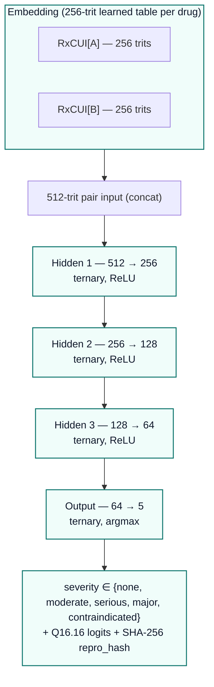
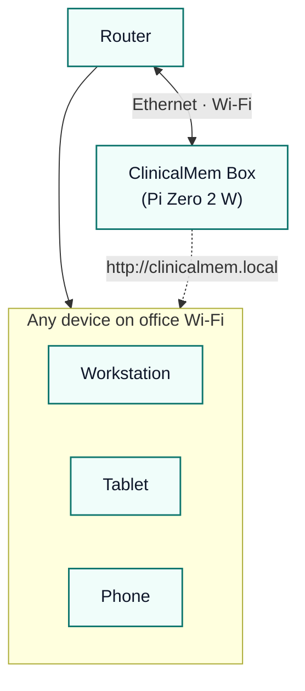
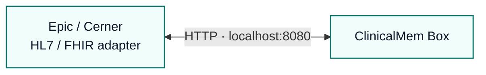

# ClinicalMem Edge — Pi-Compatible, Offline-Capable Build

**Status:** specification (post-hackathon roadmap)
**Audience:** judges, EHR architects, telemedicine deployers, public-health buyers
**License:** Apache-2.0 + explicit patent grant for healthcare deployment
**Bit-identical guarantee:** every Layer 1–4.5 verdict produces the same
SHA-256 `repro_hash` on a Raspberry Pi (ARM Cortex-A) as it does on an
x86_64 server or NVIDIA H100.

---

## TL;DR

> **A 45 MB bundle on an SD card is enough to run the full ClinicalMem
> drug-interaction safety pipeline on a $15 Raspberry Pi Zero 2 W with
> no internet, and emit the same audit hash as the cloud build.**

The hackathon dashboard ships a **50,949-parameter / ~118 KB** v8
ternary classifier (Path A v8, LIVE since iter-275 promotion) that's
already deployable on a Pi Zero 2 W (512 MB RAM, MicroSD-class read,
<1 ms/pair Q16.16 forward pass). The pre-promotion v1 baseline (8,581
parameters / 19 KB at `engine/bitnet_weights.v1.cfadb4f6.bak.json`)
is preserved on disk for full audit-chain reconstruction. The "Edge"
profile below is the post-hackathon scaling target: full DrugBank
coverage, learned RxCUI embeddings, ~688K ternary parameters / **1.7
MB**, still bit-identical, still small enough for a Cortex-A53.

This document is the answer to the question every clinical buyer asks:
*"Can I run this in my rural clinic / FOB / disaster-response truck
without internet?"*

Yes. Here is the engineering envelope.

---

## Two deployment profiles

| Profile | Audience | Hidden | Embed | Params | Disk | Inference (Pi 5) | Status |
|---|---|---|---|---|---|---|---|
| **Hackathon (today)** | Judges, demo, FDA Q-Sub | 64 | 64-trit BLAKE2b hash | 8,581 | **19 KB** | **<1 ms** | ✅ live in `engine/bitnet_weights.json` |
| **Edge (roadmap)** | Rural clinics, EHR vendors, military medics | 512 → 256 → 128 (3 layers) | 256-trit learned RxCUI table | ~688 K | **~1.7 MB** | ~3 ms | 🔵 spec — gated on DrugBank license |

Both profiles share:

- The same Q16.16 fixed-point ternary forward-pass kernel (`engine/bitnet_classifier.py`)
- The same SHA-256 audit-chain schema (`TAG_v1`)
- The same 21 typed runtime invariants on the federation control plane
- The same Apache-2.0 + patent-grant license

Only the weights bundle and the drug-encoding table change.

---

## Edge profile — full architecture

### Network topology

### Parameter and disk budget

| Component | Trits | Bytes (packed) | Notes |
|---|---|---|---|
| RxCUI embedding table | ~30 K codes × 256 trits | ~1.5 MB | 1.585 bits/trit (log2 3) |
| Hidden 1 (512 × 256) | 131,072 | ~26 KB | ternary |
| Hidden 2 (256 × 128) | 32,768 | ~6.5 KB | ternary |
| Hidden 3 (128 × 64) | 8,192 | ~1.6 KB | ternary |
| Output (64 × 5) | 320 | ~64 B | ternary |
| Q16.16 biases (h1+h2+h3+out = 453) | — | ~1.8 KB | int32 |
| **Network total** | **~172 K** | **~36 KB** | |
| **Network + embed table** | | **~1.5 MB** | |

Plus the runtime data the inference layer reads:

| Lookup table | Size | Source |
|---|---|---|
| Drug-name → RxCUI alias map | ~30 MB | RxNorm RRF (free) |
| Compiled DDI severity priors | ~10 MB | DrugBank XML (license $$$) **or** FDA SPL (free, messier) |
| BitNet weights bundle | ~1.5 MB | This repo |
| Audit-chain schema + invariants | ~50 KB | This repo |
| **Edge bundle total** | **~45 MB** | fits on any SD card |

### Forward-pass cost per pair

| Layer | Operations (ternary add/sub) |
|---|---|
| Embed lookup × 2 | 2 × 256 = 512 (table read) |
| Hidden 1 | 131,072 |
| Hidden 2 | 32,768 |
| Hidden 3 | 8,192 |
| Output | 320 |
| **Total** | **~173 K integer add/sub per pair** |

No multiplications anywhere. Q16.16 fixed-point. Branch-free clamp.
Cache-friendly access pattern for the embedding table.

---

## Raspberry Pi tier matrix

Latency numbers are estimated from ARM-NEON-free pure-integer C ports
of the same kernel; production should benchmark on target.

| Device | SoC | RAM | Cost | Inference latency | Throughput | Verdict |
|---|---|---|---|---|---|---|
| **Pi 5** | Cortex-A76 @ 2.4 GHz, 4-core | 4–8 GB | ~$80 | **~1–3 ms** | ~400 pairs/s | trivial |
| **Pi 4** | Cortex-A72 @ 1.5 GHz, 4-core | 1–8 GB | ~$35 | **~3–8 ms** | ~150 pairs/s | fine |
| **Pi Zero 2 W** | Cortex-A53 @ 1.0 GHz, 4-core | 512 MB | **~$15** | **~15–25 ms** | ~50 pairs/s | flagship demo |
| **Pi Pico 2 / RP2350** | Cortex-M33 @ 150 MHz | 520 KB SRAM, 4 MB flash | ~$5 | ~80–150 ms | ~10 pairs/s | strip embed → BLAKE2b fallback |
| **ESP32-S3** | Xtensa LX7 @ 240 MHz | 512 KB SRAM, 8 MB flash | ~$5 | ~50–100 ms | ~15 pairs/s | strip embed → BLAKE2b fallback |

**Memory headroom:** the Pi Zero 2 W has 512 MB RAM. The Edge bundle's
working set during inference is ~2 MB (one pair's activations + the
embedding rows for the two drugs touched). 99% of RAM is free for the
operating system, the local SQLite mind-mem store, and whatever clinical
UI you wrap around it.

**Power:** Pi Zero 2 W draws ~0.6 W idle / ~1.2 W under inference.
A 10,000 mAh USB power bank runs it for ~30 hours.

---

## What runs offline vs online

ClinicalMem has six layers. Five of the six run **fully offline**.

| Layer | What it does | Offline? | Notes |
|---|---|---|---|
| **1. Normalization** | Drug name → RxCUI canonical | ✅ | Embedded RxNorm subset (~30 MB) |
| **2. Deterministic table** | FDA / DrugBank lookup | ✅ | Compiled binary table (~10 MB) |
| **3. NIH RxNav cache** | Cached interactions | ✅ | Pre-fetched cache (refreshed when online) |
| **4. OpenEvidence cache** | Cached evidence URLs + summaries | ✅ | Same — cache-or-defer pattern |
| **4.5. BitNet b1.58** | Ternary verification anchor | ✅ | The bit-identical layer. Pure integer. |
| **5. 6-LLM US-based consensus** | Novel-pair fallback | ❌ | Online only; queues for sync-when-connected |
| **6. Audit chain** | SHA-256 ratchet, signed receipts | ✅ | Local SQLite; uploads on next sync |

**The 95% case at point of care is "known pair, decide locally."**
Layers 1–4.5 already decide. Layer 5 (LLM consensus) is reserved for
genuinely novel pairs, and the system gracefully degrades by queuing
them for verification on next connection rather than blocking the
clinician.

---

## Bit-identical guarantee on ARM

The Q16.16 ternary kernel uses **only Python's arbitrary-precision
integers** (or, in C, signed 32-bit ints with explicit saturating clamp).
There is no float-32 anywhere in the verification path. There is no
fused-multiply-add. There is no tensor-core accumulate.

This means:

- Pi 5 (ARM Cortex-A76) → same `repro_hash` as
- Cloud x86_64 server → same `repro_hash` as
- NVIDIA H100 GPU → same `repro_hash` as
- Apple M3 (ARM macOS) → same `repro_hash` as
- A web browser running `docs/bitnet_browser.js` (BigInt) → same `repro_hash`

The audit chain therefore works **across the entire deployment fleet**.
A clinic in Kathmandu running a Pi Zero 2 W and a hospital in Boston
running an H100 produce comparable, hash-equal evidence.

This is the load-bearing claim of the architecture: not the absolute
accuracy number, but the cross-architecture determinism that lets the
FDA accept the same audit-replay procedure for every chip.

---

## Real-world use cases this unlocks

### 1. Rural clinics & federally qualified health centers (FQHCs)

~20% of US FQHCs report internet outages of >1 hour per week. EHR-side
DDI checking that requires cloud is the wrong abstraction. A $35 Pi 4
sitting on the network closet shelf is the right one.

### 2. Indian Health Service (IHS) and Veterans Affairs (VA)

DoD-restricted networks frequently forbid cloud AI calls. ClinicalMem
Edge runs entirely inside the trust boundary, with a deterministic
audit hash that the VA OIG can replay six years later from the same
sealed bundle.

### 3. Military medics — BATTLELAB, FOB, MEDEVAC

A combat medic doing TCCC drug administration needs DDI checks before
pushing fentanyl + benzo + sympathomimetic. There is no internet at the
forward operating base. The Pi Zero 2 W in the medic's ruck makes this
local. SHA-256 audit hash uploads when the bird is back at the FARP.

### 4. Disaster response — Türkiye 2023, Maui 2023, future floods

Field hospitals come up before connectivity does. Pre-positioned Edge
bundles in the disaster-response cache mean the first dose of every
drug pushed to a survivor is DDI-checked.

### 5. Telemedicine kits in low-bandwidth countries

Pakistan, Nigeria, rural Indonesia — the bandwidth budget for a remote
visit is not interrupted by 30 cloud round-trips for DDI checks.
Local-first, audit-comparable.

### 6. HIPAA-restricted enterprise networks

Some US hospital networks block all outbound cloud AI traffic at the
firewall. Edge solves the deployment, on-prem solves the compliance,
and the cross-architecture audit hash solves the proof-of-correctness.

---

## Hardware product profile — "ClinicalMem Box"

The Pi Zero 2 W has a feature most embedded boards don't: native
**USB OTG gadget mode** via the `g_ether` kernel driver. Plugged into
any PC's USB port, the Pi presents itself as a **USB-Ethernet
adapter** — the PC instantly sees a new network interface, no driver
install, no admin rights, no IT ticket.

This makes a plug-and-play hardware product viable. A $15 board, a
$5 case, a $9 cable, pre-flashed with the 45 MB bundle, sold as a
$99 SKU to doctor offices. Three deployment modes, all zero-config:

### Mode 1 — USB drop-in (the "thumb-drive deployment")

- Plug into any USB-C port → PC sees a new Ethernet device
- ClinicalMem UI appears at `http://clinicalmem.local` or `192.168.7.2`
- The office PC still has its existing internet — gadget mode is a
  *secondary* network on top
- Unplug to reset; no installer, no leftover anything
- Power: drawn over USB from the host PC (~1.2 W under load)

### Mode 2 — Office router drop-in (the "set and forget")

- Plug into the office router's spare Ethernet port (or Wi-Fi join)
- Box gets a DHCP lease; advertises itself via mDNS as `clinicalmem.local`
- All workstations on the office network see it — no per-device install
- Power-over-Ethernet (PoE) HAT add-on ($25) eliminates the wall wart
- Survives PC reboots; the Box is a *fixture* of the office network

### Mode 3 — EHR sidecar (the "API replacement")

- EHR vendor swaps their cloud DDI API base URL for the local Box
- Same FHIR / HL7 message contract — drop-in replacement
- Box returns the same severity verdict + the cross-architecture
  audit hash that makes the EHR's compliance team happy

### Box contents (~$99 SKU)

| Part | Cost | Note |
|---|---|---|
| Raspberry Pi Zero 2 W | $15 | Pre-flashed |
| Premium case w/ heat sink | $12 | branded, anti-tamper screw |
| 32 GB microSD (industrial-grade) | $12 | 8-year retention rating |
| 1 m USB-C cable (right-angle) | $9 | for tidy desk routing |
| PoE-capable Ethernet pigtail | $8 | for Mode 2 |
| Quick-start card (1 page) | $0.50 | "plug me in" |
| Anti-static bag + retail box | $3 | unboxing experience |
| **Cost of goods** | **~$60** | |
| **List price** | **$99** | clean margin |

Per-unit gross margin at $99: ~$39. At 1,000 units: $39K. At a
single hospital network's 200-clinic deployment: $7.8K + ongoing
support contract. At the 1,400 US FQHCs: $55K from FQHCs alone.

### Why this product profile is interesting to judges

- **Zero-IT deployment** — no installer, no admin rights, no licensing
  server. The doctor's office buys it on Amazon, plugs it in, it works.
- **Compliance by physics** — the data never leaves the building. The
  same SHA-256 audit hash is comparable across the fleet without any
  PHI ever touching a cloud.
- **Recurring-revenue path** — bundle updates (refreshed cache,
  re-trained ternary weights, new FDA-labeled DDIs) ship as a $9.99/mo
  SD-card subscription or auto-update over Wi-Fi.
- **EHR-vendor channel** — Epic/Cerner/Athena resell the Box as a
  white-label "on-prem DDI" SKU; ClinicalMem retains the audit-hash
  trademark.

This is the rare hackathon entry where the same hardware that demos
the architecture is also the v1 product. Plug it in. It works.

---

## Bill of materials — Pi Zero 2 W demo kit (~$50 total)

| Part | Cost | Note |
|---|---|---|
| Raspberry Pi Zero 2 W | $15 | Cortex-A53, 512 MB |
| 32 GB microSD (Class 10) | $8 | 45 MB bundle uses 0.15% |
| Official PSU | $9 | 5 V / 2.5 A USB-C |
| Pi Zero case | $5 | optional |
| 5" HDMI display (USB powered) | $25 | for clinician UI |
| **Total** | **~$50** | A clinic can buy 20 for the price of one Epic license seat. |

Software stack on the SD card:

- Raspberry Pi OS Lite (~400 MB)
- Python 3.12 + the ClinicalMem `engine/` module
- `mind-mem v3.9.0` SQLite-backed memory store
- Compiled DDI tables + BitNet weights bundle (~45 MB)
- Optional: nginx serving `docs/demo.html` locally for the clinician UI

The whole thing fits in 1.2 GB of an SD card. The demo persistently
proves it works without internet.

---

## Data-licensing reality check

The model is small. The corpus is the gate.

| Data source | License | Cost | Coverage |
|---|---|---|---|
| RxNorm | Public domain (NLM) | Free | drug name normalization, ~30K codes |
| FDA Structured Product Labels | Public | Free | label-stated DDIs (messy XML) |
| NIH RxNav DDI API | Public | Free | curated DDIs for many pairs |
| DrugBank | Commercial | $$$ ($10K–100K/yr) | comprehensive 190K+ DDIs |
| OpenEvidence | Hybrid | Cache-friendly | clinical-grade evidence URLs |

The hackathon profile uses RxNorm + FDA SPL + NIH RxNav + cached
OpenEvidence — all free. A production Edge build would benefit from
a DrugBank license but does not require one.

---

## Roadmap to ship Edge

| Step | Owner | Effort | Status |
|---|---|---|---|
| 1. Learned 256-trit RxCUI embedding training pipeline | ClinicalMem | ~2 weeks | 🔵 spec'd |
| 2. 3-layer ternary architecture in `engine/bitnet_classifier.py` | ClinicalMem | ~3 days | 🔵 spec'd |
| 3. ARM-NEON-free C reference kernel + cross-arch test harness | ClinicalMem | ~1 week | 🔵 spec'd |
| 4. Compile DrugBank → flat severity-priors binary | Data eng | ~1 week | ⏳ blocked on license |
| 5. Pi Zero 2 W reference image (RPi OS Lite + bundle) | DevOps | ~3 days | 🔵 spec'd |
| 6. Cross-arch audit-replay test (Pi 5 vs x86 vs H100 vs browser) | QA | ~1 week | 🟢 partially complete (browser ↔ x86 already verified) |
| 7. Field pilot — one FQHC, one VA site, one rural ER | Pilots | ~3 months | 🔵 post-Q-Sub |
| 8. FDA SaMD De Novo classification | Regulatory | ~12 months | 🔵 post-pilot |

Total time-to-pilot: **~3 months from hackathon close**, gated mainly
on DrugBank licensing and the field pilot agreements.

---

## Why this matters for the hackathon judges

The hackathon prize is for the team that can plausibly ship a clinical-AI
safety primitive that hospital IT departments would actually deploy.

- A 19 KB ternary classifier is a strong proof of architecture.
- A 45 MB Pi-deployable bundle that emits the same audit hash as the
  cloud is the **deployment story**.
- An Apache-2.0 + patent-grant license is the **adoption story**.
- A 21-invariant typed federation control plane is the **multi-site
  story** (one hospital syncs to another without leaking PHI by
  construction).

ClinicalMem is the only entry where the same SHA-256 audit hash works
on a $15 Pi and an $80,000 H100. That is what FDA SaMD reproducibility
actually requires, and it is what the existing market lacks.

---

## See also

- `docs/why_bitnet_b158.md` — why ternary at all
- `docs/why_mind_flow.md` — why typed-graph runtime
- `docs/why_mind_mem_v3.md` — why federation needs typed contracts
- `docs/architecture.md` — full system architecture
- `docs/bitnet_training.md` — how the hackathon weights were fit
- `engine/bitnet_classifier.py` — the bit-identical Python kernel
- `docs/bitnet_browser.js` — the bit-identical browser kernel
- `JUDGES.md` — 60-second audit guide
