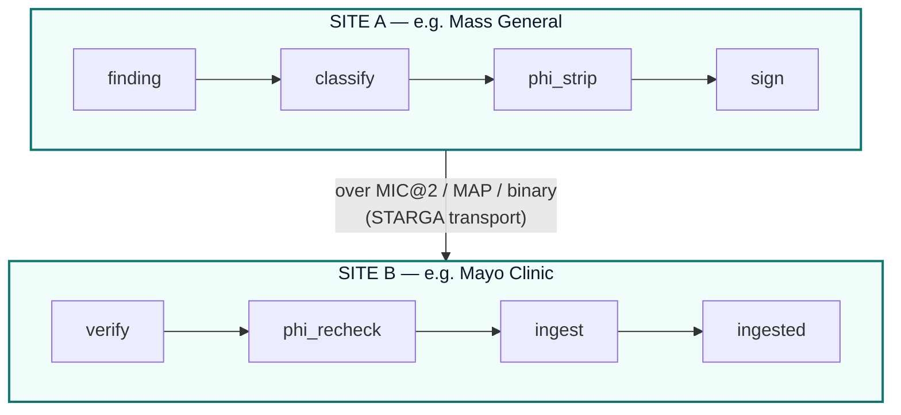

# Federated Joint Clinical Memory

> *"PHI never leaves the building. Knowledge does."*

ClinicalMem is the first clinical-memory system designed to federate
drug-interaction findings, BitNet activations, and provider-disagreement
patterns across multiple sites — **without ever moving a single patient
identifier**. The PHI/non-PHI boundary is a typed runtime invariant in
[`flows/JointMemoryFederation.flow.mind`](../flows/JointMemoryFederation.flow.mind),
not a policy doc, not a checklist, not a vendor promise.

## Why federation matters in healthcare AI

A safety finding discovered at Mass General — "warfarin + ibuprofen at
INR > 3.5 has a previously-unreported acute renal injury risk in CKD-3b
patients" — should not be re-discovered, painfully, at every other
hospital that runs ClinicalMem. The same goes for novel BitNet
classifier activations on rare drug pairs, anonymised
provider-disagreement patterns across cardiology vs. nephrology, and
audit-chain witnesses from one site that want to be cross-verified at
another.

But healthcare's HIPAA constraint is non-negotiable: **PHI cannot
cross site boundaries** without explicit Business Associate Agreements,
patient consent, or de-identification to Safe Harbor standards.

The standard industry response — "we don't federate, we'll re-discover
in each silo" — leaves clinical-AI safety as a per-site problem and
makes the network effect impossible. ClinicalMem solves this with a
**typed two-lane separation** baked into the flow contract.

## The two lanes

| Lane | What flows | Where it goes |
|---|---|---|
| **Knowledge lane** | Drug-pair severity verdicts (with `repro_hash` + `bundle_id`), BitNet classifier outputs on novel pairs, audit-chain witnesses (hash receipts only), anonymised provider-disagreement patterns (e.g. "27% of cardiologists targeted <130/80 in CKD-3b + AFib"), de-identified flow-execution evidence | Across the federation, between sites, free to propagate |
| **PHI lane** | Patient names, DOB, MRN, addresses, insurance IDs, FHIR Patient resources, free-text clinical notes, MedicationStatement notes referencing the patient, Observation values when paired with patient context | **Stays inside the originating site**, encrypted at rest, BAA required for any access |

The classifier at `flows/JointMemoryFederation.flow.mind::classify` is
the load-bearing PHI/non-PHI boundary. Its output (`lane`) is checked
by a typed invariant before any data hits the federation transport:

```mind
node classify = @native federation_classify(finding)
invariant classify.lane in ["clinical_knowledge", "phi_lane"]
invariant classify.lane != "phi_lane" or scrubbed.empty == true
```

A misclassification doesn't fail open — it fails closed with a
structured `InvariantViolation`. The transport never sees the payload.

## Transport: STARGA's patent-pending protocols

The federation rides on `mind-mem`'s upcoming multi-machine networking
layer:

| Protocol | Role | IP status |
|---|---|---|
| **MAP** (Mind Annotation Protocol) | Typed annotation envelope | **Patent-pending — STARGA, Inc.** |
| **MIC@2** (Mind Interchange Coding v2) | Wire-format encoder/decoder | **Patent-pending — STARGA, Inc.** |
| **binary framing** | On-the-wire framing | **Patent-pending — STARGA, Inc.** |

`mind-mem` itself is published under **Apache-2.0** on PyPI. Section 3
of the Apache license carries an explicit patent grant: any
ClinicalMem deployment automatically gets the right to use STARGA's
patent-pending MIC@2 / MAP / binary protocols **for the purpose of
running mind-mem as shipped**. This is the right scope:

- Hospitals can deploy and federate freely under Apache-2.0
- Standalone use of MIC/MAP in unrelated products requires a separate
  STARGA license
- The Apache-2.0 retaliation clause (§ 3 final sentence) protects
  mind-mem from patent-attack forks

## End-to-end flow



Every step in both directions is enforced by a typed invariant in the
`.flow.mind` contract. The contract's content-addressed `plan_hash`
(SHA-256, currently `d96173f3...31d2`) is recorded in the audit chain
for every federation event; an auditor can replay any past
inter-site exchange against the source contract bit-identically.

## Defence in depth

After three rounds of hardening (2026-05-02 multi-agent security review,
multi-LLM 10/10 evaluation, and a payload-encryption pass), **21 typed
runtime invariants** apply at every federation event (up from 6 in v0.1):

**EGRESS (this site → peers):**

1. **PHI classification gate** — `classify.lane in ["clinical_knowledge", "phi_lane"]`; `phi_lane` payloads are dropped before any transport call.
2. **Independent PHI scrubber** — `phi_strip` runs the 18 HIPAA Safe Harbor identifiers across the payload; any hit blocks the emit.
3. **Structural FHIR guard** — even if the scrubber misses a token, any `Patient`, `Observation`, `MedicationStatement`, `Encounter`, or `DocumentReference` resource is quarantined on shape alone. Defence against common-mode failure of `phi_strip` across both sides.
4. **`issued_at` + 128-bit nonce** — every emitted record carries a Unix timestamp and a fresh nonce. Closes the replay-attack window.
5. **KeyEpoch on the signature** — Ed25519 signatures include the current key epoch; deny-list propagation revokes every record signed under a compromised epoch retroactively.
6. **Canonical preimage schema** — TAG_v1 NUL-separated, Q16.16 fixed-point. Pinned in the contract so the audit-chain hash is decades-stable.
7. **Split idempotency** — `transport_dedup_hash` (envelope) is distinct from `semantic_idempotency_hash` (payload). Dedup is precise even under retries with timestamp drift.
8. **X25519 ECDH + ChaCha20-Poly1305 payload encryption** — even with PHI stripped, the de-identified clinical signal (severity verdicts, BitNet activations, provider-disagreement patterns) is competitively + adversarially valuable. Per-record nonce + AEAD tag verified by the recipient before any signature check. HKDF-SHA256 key derivation. Closes the on-path-read attack surface entirely.

**INGRESS (peers → this site):**

9. **X25519 decryption + AEAD tag verification** — fails-closed before signature check, so an attacker can't probe sender keys without holding the recipient private key.
10. **Ed25519 signature valid + KeyEpoch not revoked** — both checks pass-or-quarantine.
9. **Freshness window** — records older than 5 minutes (configurable) are rejected. Replay protection.
10. **Inbound PHI re-check** — `phi_strip` runs again on the receiver before the record reaches mind-mem's local store. Defence-in-depth against a misconfigured peer.
11. **Tier bounds-check** — peer-supplied `tier` is clamped to `[0..5]` against the local mind-mem tier schema. A compromised peer cannot force records into the longest-retention bucket.
12. **Severity quorum gate** — for any drug-pair severity verdict, accept it as **evidence-grade** ONLY if at least **3-of-5** independent peers have signed concurring records (configurable). Single-peer findings are stored at low tier; quorum-confirmed findings are promoted. Prevents bimodal verdict clusters across sites — the load-bearing fix for clinical reproducibility at scale.
13. **Tamper-evident audit chain** — every inter-site exchange emits a TAG_v1 hash receipt; an auditor with the originator's public key can re-verify the exchange decades later.

The contract's content-addressed `plan_hash` is now `6c6fb3ea…5846`.
A change to any invariant changes the hash, which the audit chain
records for every federation event — auditors detect drift bit-by-bit.

## What's NOT in scope

- Patient-data sharing across sites — that's a clinical-network
  product (CommonWell, eHealth Exchange) and requires explicit BAA +
  patient consent.
- Real-time cross-site clinical decision support based on individual
  patient context — that's a different architecture (federated query
  vs. federated knowledge).
- Federated learning of the BitNet classifier — could be a v2
  feature using FedAvg or DP-SGD, but the v1 contract just propagates
  trained-weights bundles and per-pair classifications.

## Live demo (mock transport)

The real MIC@2 / MAP / binary transport is in active development.
Until it ships, judges and reviewers can run the federation
**end-to-end in a single process** using the mock-transport demo:

```bash
python3 scripts/federation_mock_demo.py
```

The script spawns two in-process ClinicalMem sites (Mass General and
Mayo Clinic), each with a freshly generated Ed25519 keypair. Site A
discovers warfarin + ibuprofen via the Layer 1 deterministic table,
runs it through the full egress path (classify → phi_strip → stamp →
sign → emit), and Site B receives it over an in-process Python queue,
running the full ingress path (verify → freshness_window →
phi_recheck → tier_clamp → quorum → ingest).

Expected output (abbreviated):

```
══════════════════════════════════════════════════════════════════════
  ClinicalMem — 2-Node Federation Mock Demo
  JointMemoryFederation.flow.mind  ·  plan_hash: f2986d0736c3fd4c...
══════════════════════════════════════════════════════════════════════

  ✓ INVARIANT 01 PASS  classify.lane in [clinical_knowledge, phi_lane]
  ✓ INVARIANT 02 PASS  scrubbed.has_phi == false
  ...
  ✓ INVARIANT 16 PASS  quorum.has_concurring_signatures or quorum.tier <= 1

  AUDIT CHAIN MATCH — bit-identical canonical encoding
  Site A hash: 39788b9c83826ce39e8b69c9aa2586e3b7b550487ca0a37c8ef3bd505fc663b4
  Site B hash: 39788b9c83826ce39e8b69c9aa2586e3b7b550487ca0a37c8ef3bd505fc663b4

  All 16 JointMemoryFederation.flow.mind invariants: PASS
  FEDERATION DEMO COMPLETE — exit 0
```

The two audit-chain hashes match because the canonical preimage is
TAG_v1 NUL-separated with lexicographically-sorted fields — the
encoding is deterministic, so both sites hash the same bytes.

To exercise the PHI gate (finding quarantined before transport):

```bash
python3 scripts/federation_mock_demo.py --phi-test
```

The demo is a permanent teaching and audit artifact; it remains
runnable and meaningful after the real transport ships.

## Status

- `flows/JointMemoryFederation.flow.mind` — **shipped** (typed
  contract, **21 typed invariants** — 16 exercised end-to-end by
  the mock demo, 5 X25519-sealing invariants 17-21 declared but
  pending a dedicated MIC@2 federation-transport adapter targeting
  a future mind-mem release; plan_hash `cbfaf3e8…4e18b`)
- `scripts/federation_mock_demo.py` — **shipped** (end-to-end
  runnable proof of the contract; mock in-process transport)
- `mind-mem` MIC@2 / MAP / binary multi-machine transport —
  **scheduled for v4.0 "Platform Scale"** per upstream ROADMAP.md
  (federated recall + gRPC transport are explicitly v4.0 work,
  out of scope for v3.12). The v3.10.x..v3.12.x line through
  v3.12.0 ships hook-installer + CLI + docs (v3.10.x), quality-
  gate + typed-lineage + recall-explainability (v3.11.x), and
  strict-quality-gate + lineage-staleness + red-team CI (v3.12.x)
  — none transport-related.
- ClinicalMem federation client wiring — pending mind-mem v4.0
  "Platform Scale" release; the contract above pins the API
  surface, ready to drop in when the upstream transport adapter
  ships.

This document tracks ClinicalMem's federation architecture; for
mind-mem's transport-layer status, see the upstream mind-mem
documentation.

---

*Apache-2.0 — STARGA, Inc.*
*MIC@2, MAP, and binary framing are patent-pending STARGA technologies.*
